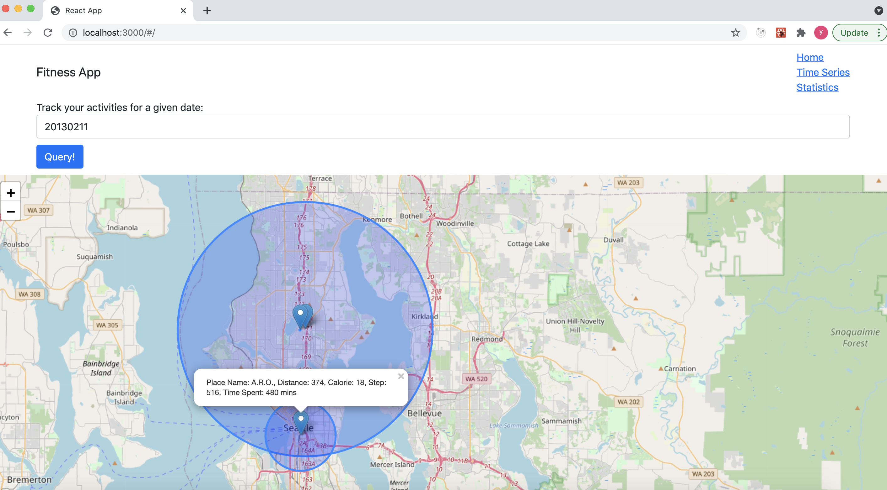
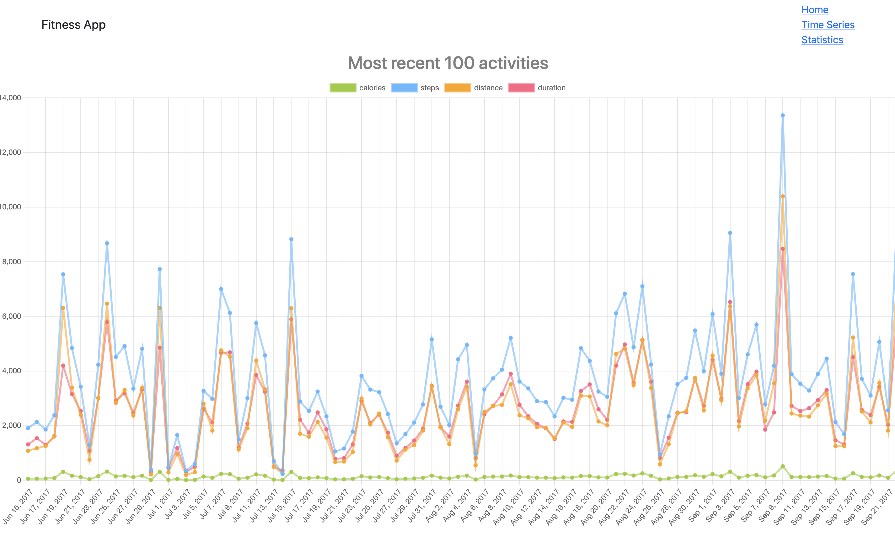
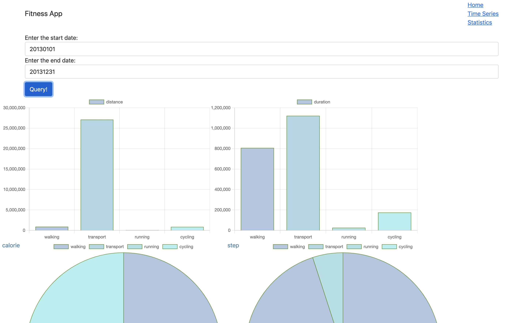
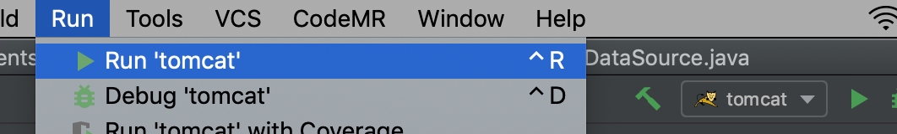
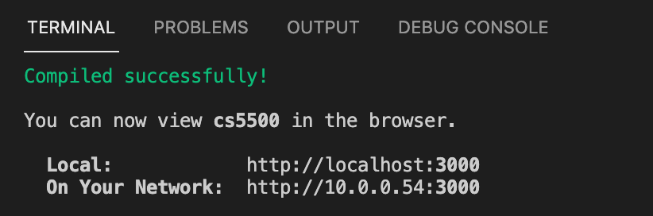
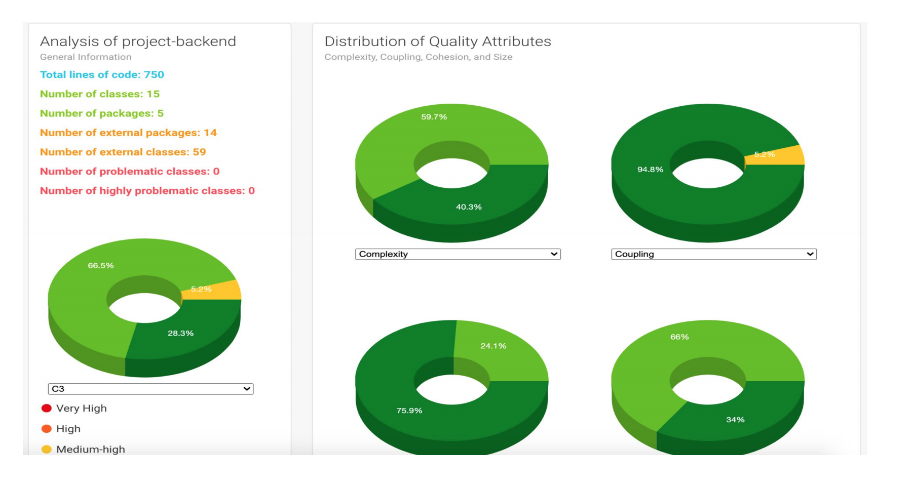
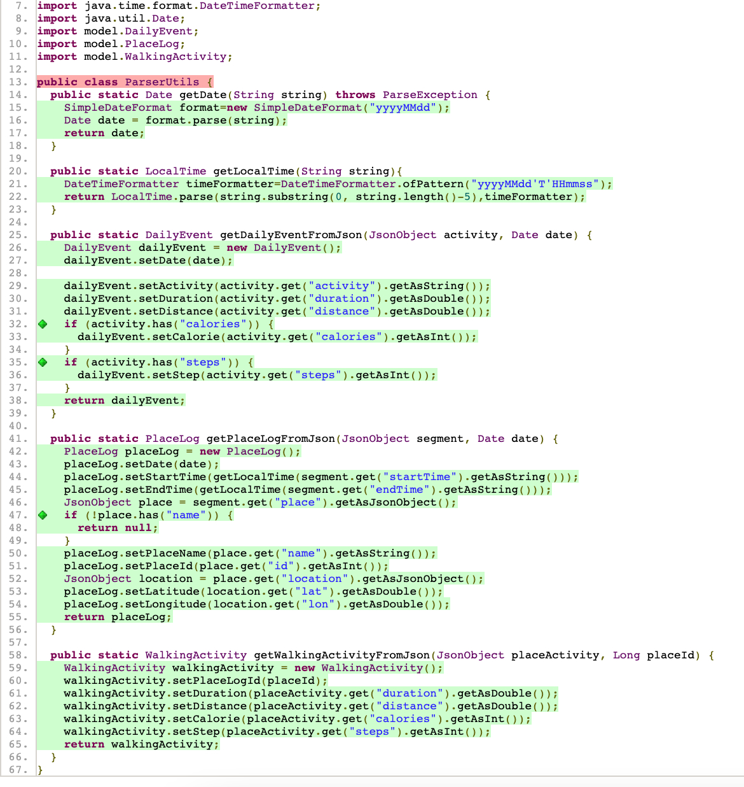

# Fitness App

## Features Delivered
- Overview
    - In the fitness app, we delivered 3 webpages for users to track the calories, steps, distance, duration and location of their daily activities (e.g. walking, transport, running, cycling...).
    - The webpages include: heat map, timeseries analysis, and dashboard page

- Heat Map
    - In the heatmap page, the user inputs a date, then the app will query the locations which the user has visited for the given date, and display the places on the map based on their longitude and latitude.
    - When the user clicks on the location, it will show a popup, displaying the calories, steps, distance and time spent in the location.
    
    
- Timeseries Graph
    - In the timeseries page, we display the most recent 100 walking activities for the user, and show the variation in their attributes such as calories, steps, distance.
    - By clicking on the labels, the user can also filter on which information to display. For example, it can only show the calories vs steps, or steps vs distance etc, which supports the user to track the activities and see their fitness progress.
    

- Dashboard Page    
    - In the dashboard page, the user inputs a time range, and the app will show the comparison in calories, steps, distance and duration across different activites in this given period. 
    - For example, the user can get an idea of how much calories the user spend when walking compared with cycling, or how many steps the user take when walking compared with running during the given period of time.
    

## How to run the app
- Where the code is
    - https://github.ccs.neu.edu/nagaichsid/CS5500_Project
- How to build the code
    - Backend
        - The backend is in Java, hosted by tomcat. 
        - To build the backend, open the IntelliJ, then click Run -> Run tomcat
         
    - Frontend
        - The frontend is written in React, hosted by node.
        - To build the frontend, open a terminal in the folder and run `npm start`, and you'll see
        
        - Then open a browser, and visit `localhost:3000`
- How to setup/install the product
    - The product is hosted as webpages, the user can install the app with the following steps.
        - Run `git clone https://github.ccs.neu.edu/nagaichsid/CS5500_Project.git` in the terminal
        - Checkin the project folders `Sprint3/frontend` and `Sprint3/backend`
        - Follow the steps above to build the app
        - Visit the webpages to track the activites.
- Known problems
    - There is a known problem with the integration of Leaflet API with Create React App. See here (https://stackoverflow.com/questions/67551922/cra-react-leaflet-failed-to-compile) for more details. 
    - The way we solved it is to go to `package.json` and replace 
                `"browserslist": {
                 "production": [
                  ">0.2%",
                  "not dead",
                  "not op_mini all"
                ],
                "development": [
                  "last 1 chrome version",
                  "last 1 firefox version",
                  "last 1 safari version"
                ]
                },`
                with 
                `"browserslist": [
                ">0.2%",
                "not dead",
                "not op_mini all"
                ],`
    - The problem may reoccur if the user accidentally runs `npm install` before running `npm start`, because the `package.json` might lose the previous revisions. To solve this problem, the user needs to redo the above steps by going to `package.json` and replace the `browserslist` accordingly.

- Code Metrics
    
    - CodeMR metrics depicting generally excellent levels of complexity, coupling, lack of cohesion, and size. 
    - The only area in which there are sub-optimal levels of any metric is in our DumpDB class' coupling, as it interacts with all others classes.
    
    - ParserUtils and Model classes have been unit-tested with complete code coverage

- Any other relevant documents
    - React: https://reactjs.org/docs/create-a-new-react-app.html
    - React-chartjs: https://www.npmjs.com/package/react-chartjs-2
    - Leaflet: https://leafletjs.com/reference-1.7.1.html
    - Tomcat: http://tomcat.apache.org/tomcat-9.0-doc/index.html
    - JDBC: https://docs.oracle.com/javase/tutorial/jdbc/basics/gettingstarted.html
    - MySQL: https://www.mysql.com/downloads/
